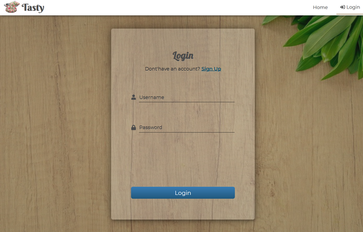
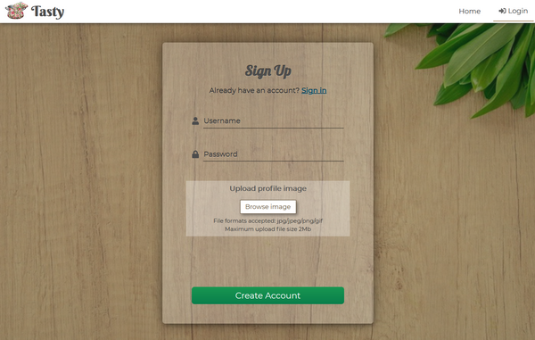

# Tasty
## Full stack MEVN app
#### Built and deployed to Heroku (posible quite slow initial loading due to Heroku puts apps to sleep after 30 minutes of inactivity)
---
## Tools/libraries: 
* CLIENT
  * Vue.js
  * Vuex
  * Vue router
  * SCSS - responsive layout, flexbox & grid
  * vuex-persistedstate
  * vue-axios
  * @fortawesome
* SERVER
  * Node/Express.js
  * Mongodb Atlas
  * Mongoose
  * JWT
  * @hapi/joi validator
  * Multer 
  * Cloudinary (image upload)
---
Custom Popular recipes slider, Pagination, Select dropdown, Rating, Tooltip, etc, no extra libraries included
---
---
## Views
### Home
&nbsp;  
---
&nbsp;  
---
&nbsp;  
---
&nbsp;  
---
&nbsp;  
---
---

### Render Results

&nbsp;  
---
---

### Single Result
&nbsp;  
---
&nbsp;  
---
&nbsp;  
---
---

### Login/Sign up
&nbsp;  
---
&nbsp;  
---
---

### User Panel

##### User Profile
&nbsp;  
---

##### My recipes
&nbsp;  
---
&nbsp;  
---
&nbsp;  
---

##### Saved recipes
&nbsp;  
---

##### Create recipe
&nbsp;  
---
&nbsp;  
---
&nbsp;  
---
---

### Admin Panel
##### Overview
&nbsp;  
---

##### Admin Users
&nbsp;  
--- 
&nbsp;  
---
&nbsp;  
---

##### Admin Recipes
&nbsp;  
---

##### Admin Comments
&nbsp;  
---
---
## Random screenshots - small devices
&nbsp;  
---
&nbsp;  
---
&nbsp;  
---
&nbsp;  
---
&nbsp;  
---
&nbsp;  
---  
&nbsp;  
---
&nbsp;  
---
&nbsp;  
---
